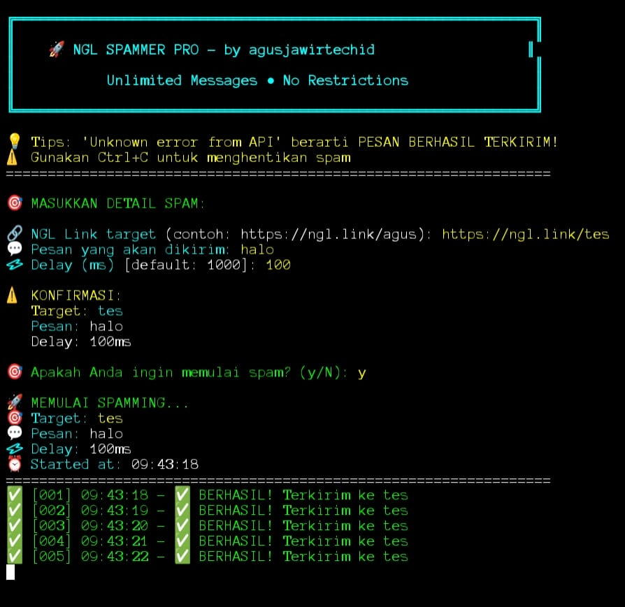
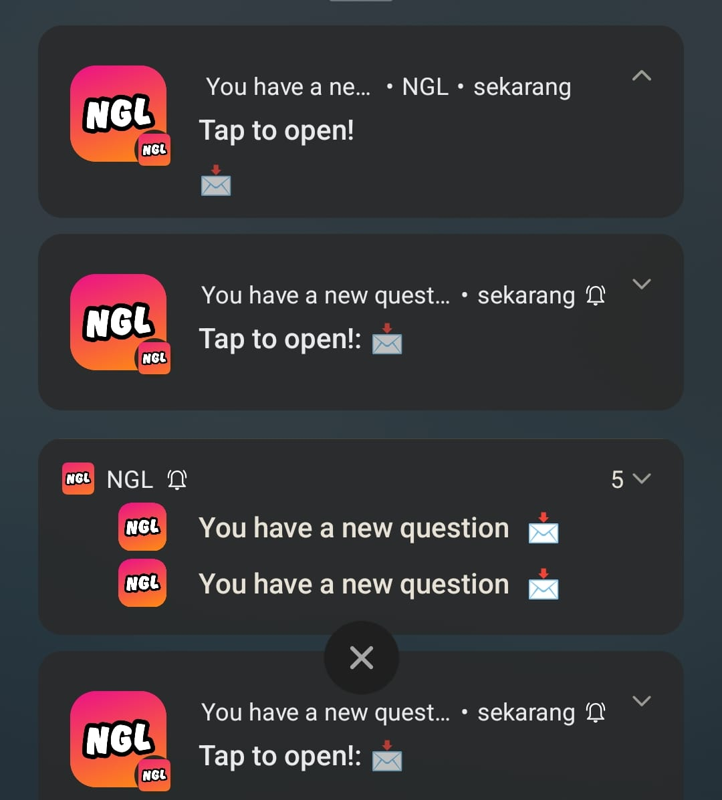

# 🚀 NGL SPAMMER PRO  
Powerful Auto NGL Message Sender — Fast • Modern • Unlimited

<div align="center">


Modern • Super Fast • User Friendly


</div>

---

## ✨ Fitur Utama

| Feature | Description |
|--------|-------------|
| ⚡ Super Fast | Spam ultra cepat tanpa batas |
| 🔥 Modern UI | Terminal neon aesthetic |
| 📱 Termux Support | Android full support |
| 🐧 Linux Support | Ubuntu, Debian, Mint |
| 🪟 Windows Support | CMD & PowerShell OK |
| 🎨 Clean Interface | Full warna, no ribet |
| 🧠 User Friendly | Tinggal masukin data & jalan |

---

## 🖼️ Preview

### 💻 Tampilan Terminal  
<div align="center">
  
  <br><em>Interface modern neon aesthetic</em>
</div>

### 📱 Notifikasi NGL  
<div align="center">
  
  <br><em>Contoh notifikasi yang berhasil terkirim</em>
</div>

---

# 📦 Installation Guide

---

## 📱 Termux (Android)

```bash
pkg update && pkg upgrade -y
pkg install git python3 -y

git clone https://github.com/agusjawirtechid/nglspammerpro
cd nglspammerpro

python3 spam.py
```

---

## 🐧 Linux / Ubuntu

```bash
sudo apt update && sudo apt upgrade -y
sudo apt install python3 git python3-pip -y

git clone https://github.com/agusjawirtechid/nglspammerpro
cd nglspammerpro

python3 spam.py
```

---

## 🪟 Windows

> Wajib install:  
> ✔ Python 3.8+  
> ✔ Git for Windows  

```cmd
git clone https://github.com/agusjawirtechid/nglspammerpro
cd nglspammerpro
python spam.py
```

---

# 🎯 Cara Menggunakan

1. Masukkan link target NGL (contoh: https://ngl.link/username)  
2. Masukkan pesan spam  
3. Atur delay (1000–5000 ms direkomendasikan)  
4. Konfirmasi pengaturan  
5. Spam berjalan otomatis 🔥  

---

# ⚠️ Tips & Troubleshooting

### 💡 Tips
- Gunakan delay wajar agar tidak limit  
- Internet stabil wajib  
- Restart script kalau freeze  

### ❗ Masalah Umum
| Error | Penyebab |
|-------|----------|
| Unknown API Error | Pesan sebenarnya terkirim |
| Connection Error | Internet lemah |
| Module Not Found | Jalankan `pip install -r requirements.txt` |

---

# ⭐ Dukung Project

- ⭐ Beri bintang  
- 🍴 Fork untuk modifikasi  
- 🐛 Report bug  
- 💡 Ajukan fitur baru  

---

# 👨‍💻 Developer  
<div align="center">

🔥 **agusjawirtechid**  
**Project by Agus Jawa**

  


</div>

---

# 🚀 Quick Start

```bash
git clone https://github.com/agusjawirtechid/nglspammerpro
cd nglspammerpro
python3 spam.py
```

---

<div align="center">

⚠ Gunakan dengan bijak. Developer tidak bertanggung jawab atas penyalahgunaan.

</div>
